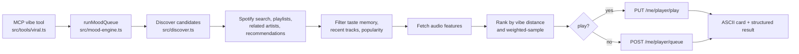

# Architecture

AUX is an MCP stdio server whose tools orchestrate Spotify Web API calls and
small local state stores. This map reflects the 0.4.x layout.

## Request path

`src/server.ts` creates the MCP server and calls `registerAllTools()` in
`src/tools/register.ts`. Each tool module validates its MCP input with Zod,
then calls the shared `SpotifyClient` in `src/client.ts`. The client selects an
access token, adds the Spotify API base URL and bearer header, and normalises
errors before the tool formats its MCP response.

| MCP surface | Registration module | Main Spotify endpoint families | Auth |
|---|---|---|---|
| `auth_status` | `src/tools/meta.ts` | Local token/config status; no Web API request | Local |
| `search_*`, catalog `get_*`, recommendations, audio features, browse | `src/tools/search-browse.ts` | `/search`, `/tracks`, `/artists`, `/albums`, `/playlists`, `/recommendations`, `/audio-features`, `/browse` | Auto |
| Playback, queue, devices | `src/tools/playback.ts` | `/me/player`, `/me/player/currently-playing`, `/me/player/queue`, `/me/player/devices` | User |
| Playlist CRUD and items | `src/tools/playlists.ts` | `/me/playlists`, `/users/{id}/playlists`, `/playlists/{id}`, `/playlists/{id}/tracks` | User |
| Saved tracks and albums | `src/tools/library.ts` | `/me/tracks`, `/me/albums` | User |
| Top/recent/follow/profile | `src/tools/personalization.ts` | `/me/top/*`, `/me/player/recently-played`, `/me/following`, `/me` | User |
| `set_mood`, playlist analysis/adjustment, taste memory | `src/tools/hooks.ts` | Catalog/audio-feature and playlist/player endpoints plus `src/memory.ts` | Mixed |
| `vibe`, playlist comparisons/blends, local party queue, playback story | `src/tools/viral.ts` | Orchestrates `src/discover.ts`, `src/mood-engine.ts`, `src/party.ts`, and player/playlist endpoints | Mixed |
| Context vibe, weekly report, Auto-DJ, party rooms | `src/tools/peak.ts` | Orchestrates `src/context.ts`, `src/autodj.ts`, `src/rooms.ts`, and the same catalog/player endpoints | Mixed |
| MCP prompts | `src/prompts.ts` | Prompt templates only; no direct Web API request | None |

“Auto” means `src/auth.ts` prefers a cached user token and falls back to a
client-credentials token for public catalog data. “User” requires the PKCE
login created by `npx spotify-aux login`; the token is refreshed
automatically. Playback additionally requires Spotify Premium and an active
device. Tokens live under `~/.aux-mcp/` and must never be committed.

## Vibe pipeline

The host model interprets free text and supplies search queries plus target
energy, valence, and tempo. AUX deliberately does not keep a hard-coded vibe
dictionary.

Candidate discovery is best-effort: restricted recommendation or related
artist endpoints may fail without aborting the whole request. When audio
features are unavailable, `runMoodQueue` still produces a shuffled catalog
sample. Taste feedback in `src/memory.ts` adjusts filtering and ranking on
later calls.

## State outside Spotify

| State | Module | Purpose |
|---|---|---|
| Taste feedback | `src/memory.ts` | Persist skips, repeats, likes, avoid/prefer IDs |
| Auto-DJ session | `src/autodj.ts` | Persist the active vibe and refill playback |
| Local party queue | `src/party.ts` | Suggestions and votes within one AUX process/store |
| Shared party rooms | `src/rooms.ts` | Host/join relay workflow used by `party_room_*` |
| Ambient context | `src/context.ts` | Time/day and optional weather used by `context_vibe` |
| Presentation | `src/cards.ts`, `src/format.ts` | ASCII cards and compact Spotify entities |

When adding a tool, register it in the closest `src/tools/*.ts` module, include
that module from `src/tools/register.ts` if it is new, choose the narrowest auth
mode explicitly for user-only endpoints, and update this map when introducing a
new endpoint family or state store.
